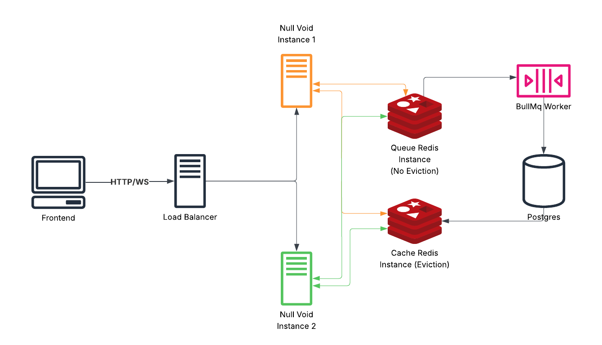

# Null-Void

Virtual whiteboard for real-time collaborative drawing and brainstorming.

Create a room, invite your team, and draw together, live. Everything you create is persisted, so the canvas is exactly where you left it when you come back.

## Architecture

Built as a monorepo with a WebSocket-first backend designed for scalability and fault tolerance. The architecture uses dual Redis instances (cache + queue), binary-encoded canvas snapshots, distributed locking, and background job processing to keep rooms fast and consistent at scale.

## Architecture



_Figure: Distributed architecture showing frontend, backend, Redis layers, and background processing._

## Features

- Real-time collaborative canvas with live cursor tracking
- Persistent rooms (canvas state is saved and restored across sessions)
- Role-based access control (Admin / Viewer)
- Room invites via email
- Distributed WebSocket scaling with Redis Pub/Sub
- Binary-encoded canvas snapshots with background compaction via BullMQ
- Dual Redis setup for cache and durable queue state

## Project Structure

```
null-void/
├── docs/                   # Documentation
│   ├── ADRs/               # Architecture Decision Records
├── apps/
│   ├── server/              # Main NestJS server application
│   │   ├── prisma/          # Prisma schema and migrations
│   │   ├── proto/           # Proto files for draw events
│   │   ├── test/            # E2E Test files
│   │   ├── src/
│   │   │   ├── modules/     # Feature modules (auth, rooms, accounts, etc.)
│   │   │   ├── core/        # Core application logic (database services, cache services etc.)
│   │   │   ├── common/      # Common utilities and helpers
│   │   │   ├── app.module.ts # Main application module
│   │   │   └── main.ts      # Application entry point
│   │   └── package.json     # Server dependencies
│   │
│   ├── processor/           # Background job processor/worker (BullMQ)
│   │   ├── proto/           # Proto files for draw events
│   │   ├── src/
│   │   │   ├── lib/        # Job handlers and processors
│   │   │   ├── types/      # TypeScript type definitions
│   │   │   ├── utils/      # Utility functions
│   │   │   └── index.ts    # Processor entry point
│   │   ├── Dockerfile      # Processor Dockerfile
│   │   └── package.json     # Processor dependencies
│   │
│   └── shared/              # Shared code between apps
│       ├── src/
│       │   ├── types/       # TypeScript type definitions
│       │   ├── utils/       # Utility functions
│       │   └── constants/   # Shared constants
│       ├── index.ts         # Shared entry point
│       └── package.json     # Shared dependencies
│
├── ops/                     # Docker and deployment configs
│   ├── docker-compose.yml   # Docker orchestration
│   ├── cache-redis.conf     # Redis configuration for cache
│   ├── queue-redis.conf     # Redis configuration for queue
│
├── .env.server.example      # Server environment template
├── .env.processor.example   # Processor environment template
├── package.json             # Root workspace configuration
└── README.md                # This file
```

## Testing

Tests only exist for the server app.

```bash

$ cd apps/server

$ npm run test

$ npm run test:e2e

```

## Project Setup

- Clone the repository

```bash
$ git clone https://github.com/shubomifashakin/Null-Void.git
```

- Install dependencies

```bash
$ npm install
```

- Configure environment variables

```bash
$ cp .env.server.example apps/server/.env

$ cp .env.processor.example apps/processor/.env
```

- Build

```bash
$ npm run build
```

- Run dev server

```bash
$ npm run dev:server
```

- Run dev processor

```bash
$ npm run dev:processor
```

- Run migrations

```bash
cd apps/server

$ npx prisma migrate dev
```

## Running the Application Via Docker

```bash
$ cp .env.server.example ops/.env.server

$ cp .env.processor.example ops/.env.processor

$ docker build -f apps/server/Dockerfile -t null-void-server:latest .

$ docker build -f apps/processor/Dockerfile -t null-void-processor:latest .

$ cd ops

$ docker-compose up -d
```

## API Documentation

The API documentation is generated using Swagger/OpenAPI and is available at:

Local Development: http://localhost:PORT_USED/api/docs

The Swagger documentation is generated from code annotations, ensuring it stays in sync with the implementation. All endpoints, request/response DTOs, and authentication requirements are documented with examples and schemas.
